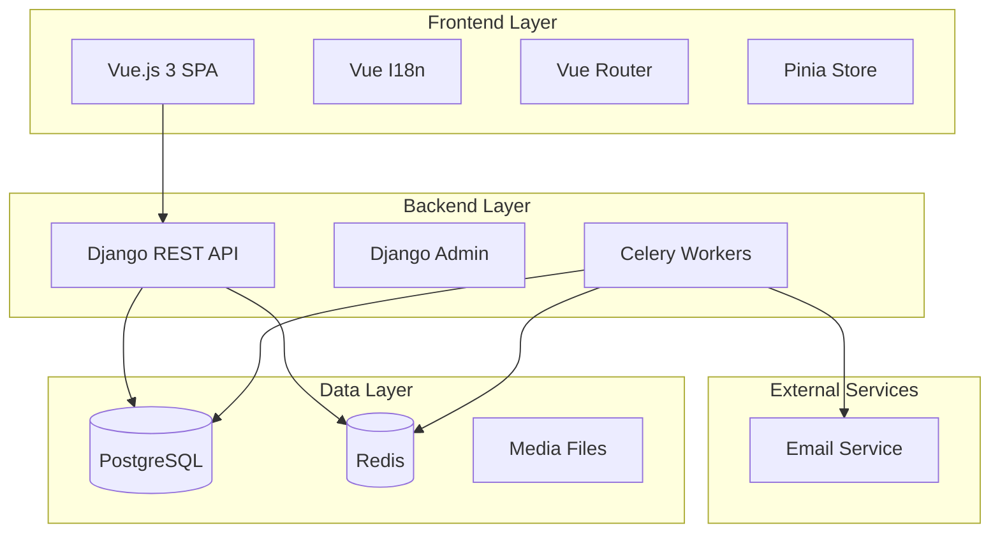
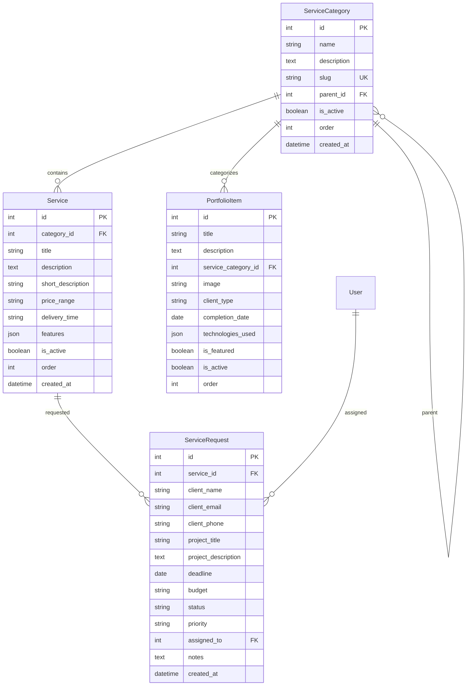

# Design Document

## Overview

The Student Services Website is a bilingual (Arabic/English) platform that connects students with academic service providers. The system follows a modern web architecture with a Django REST API backend and Vue.js frontend, supporting multilingual content, service management, request processing, and portfolio showcase.

## Architecture

### High-Level Architecture



### Technology Stack

**Backend:**
- Django 4.x with Django REST Framework
- PostgreSQL for primary data storage
- Redis for caching and session storage
- Celery for background task processing
- django-modeltranslation for multilingual content

**Frontend:**
- Vue.js 3 with Composition API
- Vue Router for client-side routing
- Pinia for state management
- Vue I18n for internationalization
- Tailwind CSS for styling with RTL support
- Vite for build tooling

**Infrastructure:**
- Docker containers for development
- Nginx for static file serving (production)

## Components and Interfaces

### Backend Components

#### Django Apps Structure

```
backend/
├── apps/
│   ├── services/          # Service catalog management
│   ├── requests/          # Service request handling
│   ├── portfolio/         # Portfolio showcase
│   └── contact/           # Contact form handling
├── config/                # Django configuration
└── locale/                # Translation files
```

#### Core Models

**ServiceCategory Model**
```python
class ServiceCategory(models.Model):
    name = models.CharField(max_length=100)
    description = models.TextField()
    slug = models.SlugField(unique=True)
    parent = models.ForeignKey('self', null=True, blank=True)
    is_active = models.BooleanField(default=True)
    order = models.PositiveIntegerField(default=0)
    created_at = models.DateTimeField(auto_now_add=True)
```

**Service Model**
```python
class Service(models.Model):
    category = models.ForeignKey(ServiceCategory)
    title = models.CharField(max_length=200)
    description = models.TextField()
    short_description = models.CharField(max_length=300)
    price_range = models.CharField(max_length=100)
    delivery_time = models.CharField(max_length=100)
    features = models.JSONField(default=list)
    is_active = models.BooleanField(default=True)
    order = models.PositiveIntegerField(default=0)
    created_at = models.DateTimeField(auto_now_add=True)
```

**ServiceRequest Model**
```python
class ServiceRequest(models.Model):
    STATUS_CHOICES = [
        ('pending', 'Pending'),
        ('in_progress', 'In Progress'),
        ('completed', 'Completed'),
        ('cancelled', 'Cancelled'),
    ]
    
    service = models.ForeignKey(Service)
    client_name = models.CharField(max_length=100)
    client_email = models.EmailField()
    client_phone = models.CharField(max_length=20)
    project_title = models.CharField(max_length=200)
    project_description = models.TextField()
    deadline = models.DateField()
    budget = models.CharField(max_length=100)
    status = models.CharField(max_length=20, choices=STATUS_CHOICES)
    priority = models.CharField(max_length=10, default='normal')
    assigned_to = models.ForeignKey(User, null=True, blank=True)
    notes = models.TextField(blank=True)
    created_at = models.DateTimeField(auto_now_add=True)
```

**PortfolioItem Model**
```python
class PortfolioItem(models.Model):
    title = models.CharField(max_length=200)
    description = models.TextField()
    service_category = models.ForeignKey(ServiceCategory)
    image = models.ImageField(upload_to='portfolio/')
    client_type = models.CharField(max_length=100)  # Anonymized
    completion_date = models.DateField()
    technologies_used = models.JSONField(default=list)
    is_featured = models.BooleanField(default=False)
    is_active = models.BooleanField(default=True)
    order = models.PositiveIntegerField(default=0)
```

#### API Endpoints

**Public API Endpoints:**
- `GET /api/services/categories/` - List service categories
- `GET /api/services/categories/{id}/` - Category details with services
- `GET /api/services/{id}/` - Service details
- `POST /api/requests/` - Submit service request
- `GET /api/portfolio/` - List portfolio items
- `GET /api/portfolio/{id}/` - Portfolio item details
- `POST /api/contact/` - Submit contact form

**Admin API Endpoints:**
- `GET/POST/PUT/DELETE /api/admin/services/` - Service management
- `GET/PUT /api/admin/requests/` - Request management
- `GET /api/admin/dashboard/stats/` - Dashboard statistics
- `GET/POST/PUT/DELETE /api/admin/portfolio/` - Portfolio management

### Frontend Components

#### Component Architecture

```
frontend/src/
├── components/
│   ├── common/            # Reusable components
│   ├── layout/            # Layout components
│   ├── services/          # Service-related components
│   ├── portfolio/         # Portfolio components
│   └── admin/             # Admin interface components
├── views/                 # Page components
├── stores/                # Pinia stores
├── composables/           # Vue composables
├── locales/               # Translation files
└── utils/                 # Utility functions
```

#### Key Components

**ServiceCatalog Component**
- Displays services in grid/list layout
- Supports filtering by category
- Implements search functionality
- Handles language switching

**ServiceRequestForm Component**
- Multi-step form for service requests
- File upload capability
- Form validation with i18n error messages
- Progress indicator

**PortfolioGallery Component**
- Masonry/grid layout for portfolio items
- Category filtering
- Modal view for item details
- Lazy loading for images

**AdminDashboard Component**
- Request management interface
- Service management tools
- Analytics and reporting
- Bulk operations

#### State Management (Pinia Stores)

**Services Store**
```javascript
export const useServicesStore = defineStore('services', {
  state: () => ({
    categories: [],
    services: [],
    currentService: null,
    loading: false
  }),
  actions: {
    async fetchCategories(),
    async fetchServices(categoryId),
    async getServiceDetails(id)
  }
})
```

**Language Store**
```javascript
export const useLanguageStore = defineStore('language', {
  state: () => ({
    currentLanguage: 'en',
    direction: 'ltr'
  }),
  actions: {
    setLanguage(lang),
    toggleDirection()
  }
})
```

## Data Models

### Database Schema



### Translation Strategy

Using django-modeltranslation for backend content translation:

```python
# translation.py
from modeltranslation.translator import register, TranslationOptions

@register(ServiceCategory)
class ServiceCategoryTranslationOptions(TranslationOptions):
    fields = ('name', 'description')

@register(Service)
class ServiceTranslationOptions(TranslationOptions):
    fields = ('title', 'description', 'short_description', 'features')
```

Frontend translations managed through Vue I18n with separate message files for Arabic and English.

## Error Handling

### Backend Error Handling

**API Error Response Format:**
```json
{
  "error": {
    "code": "VALIDATION_ERROR",
    "message": "Invalid input data",
    "details": {
      "field_name": ["Error message"]
    }
  }
}
```

**Error Types:**
- Validation errors (400)
- Authentication errors (401)
- Permission errors (403)
- Not found errors (404)
- Server errors (500)

**Custom Exception Handler:**
```python
def custom_exception_handler(exc, context):
    response = exception_handler(exc, context)
    if response is not None:
        custom_response_data = {
            'error': {
                'code': get_error_code(exc),
                'message': str(exc),
                'details': response.data
            }
        }
        response.data = custom_response_data
    return response
```

### Frontend Error Handling

**Global Error Handler:**
```javascript
// Error interceptor for API calls
axios.interceptors.response.use(
  response => response,
  error => {
    const errorStore = useErrorStore()
    errorStore.handleError(error)
    return Promise.reject(error)
  }
)
```

**User-Friendly Error Messages:**
- Network connectivity issues
- Form validation errors
- Server unavailability
- Session expiration

## Testing Strategy

### Backend Testing

**Unit Tests:**
- Model validation and methods
- Serializer functionality
- API endpoint responses
- Business logic functions

**Integration Tests:**
- API endpoint workflows
- Database operations
- Email notification system
- Celery task execution

**Test Structure:**
```python
class ServiceAPITestCase(APITestCase):
    def setUp(self):
        # Test data setup
        
    def test_service_list_endpoint(self):
        # Test service listing
        
    def test_service_request_creation(self):
        # Test request submission
```

### Frontend Testing

**Unit Tests (Vitest):**
- Component rendering
- Store actions and mutations
- Utility functions
- Composables

**Integration Tests:**
- API communication
- Form submissions
- Navigation flows
- Language switching

**E2E Tests (Cypress):**
- Complete user journeys
- Service request workflow
- Admin panel operations
- Cross-browser compatibility

### Testing Coverage Goals

- Backend: 90%+ code coverage
- Frontend: 85%+ code coverage
- Critical paths: 100% coverage

## Security Considerations

### Authentication & Authorization

**Backend Security:**
- Django session authentication for admin
- CSRF protection enabled
- Rate limiting on API endpoints
- Input validation and sanitization

**Frontend Security:**
- XSS protection through Vue.js
- CSRF token handling
- Secure API communication
- Input validation on forms

### Data Protection

**Privacy Measures:**
- Client information anonymization in portfolio
- Secure file upload handling
- Email address validation
- GDPR compliance considerations

**Security Headers:**
```python
SECURE_BROWSER_XSS_FILTER = True
SECURE_CONTENT_TYPE_NOSNIFF = True
X_FRAME_OPTIONS = 'DENY'
SECURE_HSTS_SECONDS = 31536000
```

## Performance Optimization

### Backend Optimization

**Database Optimization:**
- Proper indexing on frequently queried fields
- Query optimization with select_related/prefetch_related
- Database connection pooling
- Redis caching for frequently accessed data

**API Optimization:**
- Pagination for large datasets
- Response compression
- Efficient serialization
- Background task processing with Celery

### Frontend Optimization

**Loading Performance:**
- Code splitting by routes
- Lazy loading of components
- Image optimization and lazy loading
- Bundle size optimization

**Runtime Performance:**
- Virtual scrolling for large lists
- Debounced search inputs
- Efficient state management
- Minimal re-renders

**Caching Strategy:**
- Browser caching for static assets
- API response caching
- Service worker for offline capability
- CDN integration for media files

## Deployment Architecture

### Development Environment
- Docker Compose with hot reloading
- Separate containers for each service
- Volume mounting for code changes
- Development-specific settings

### Production Environment
- Containerized deployment with Docker
- Nginx reverse proxy
- SSL/TLS termination
- Environment-based configuration
- Automated database migrations
- Static file serving optimization

This design provides a solid foundation for implementing the student services website with all the required functionality, proper multilingual support, and scalable architecture.